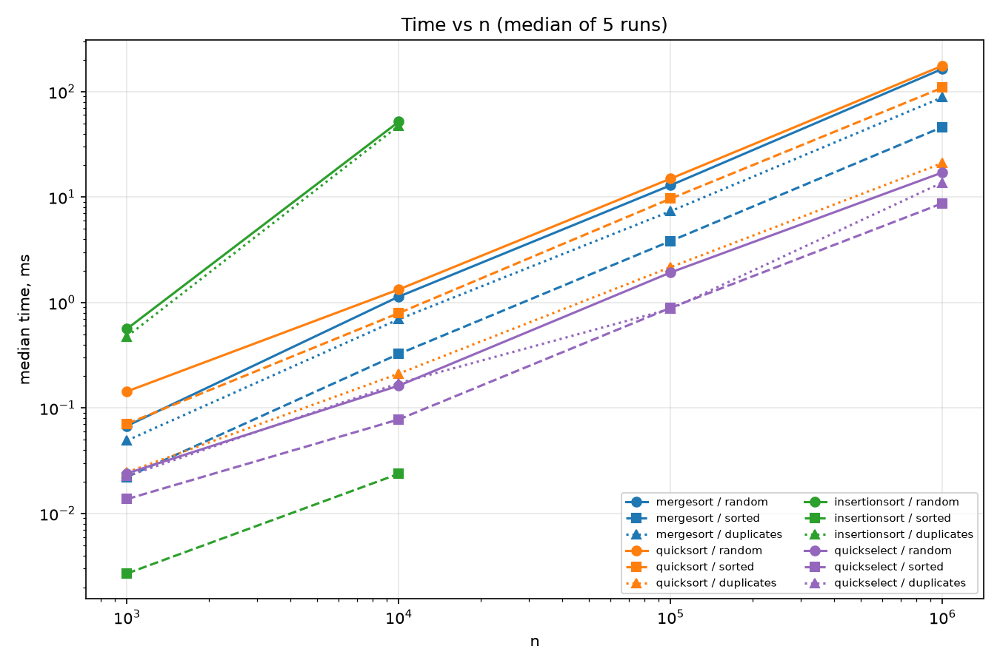
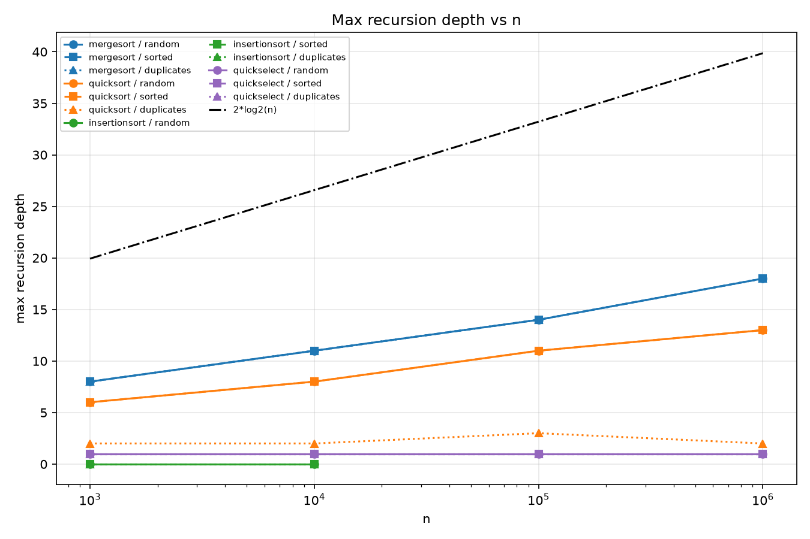
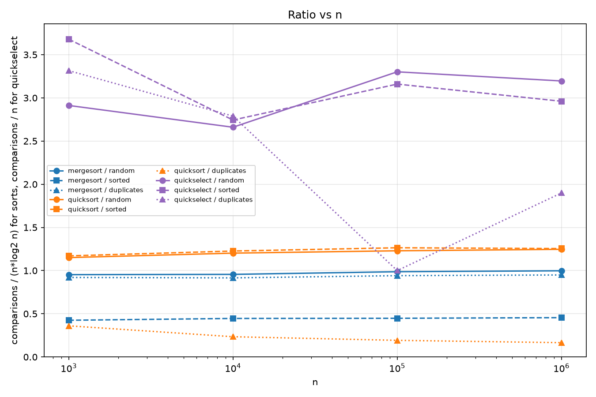

# DAA Assignment 1 — Fast Sorting & Selection Engine

**Yersaiyn Taubay — group SE2524**
Java (compiled with `--release 21`) · JUnit 5 · Maven. All numbers below come from `results.csv`,
produced by `mvn -q compile exec:java` in the environment described in section 4.

---

## 1. What was built

| Component | File | Key design decision |
|---|---|---|
| MergeSort | `algorithms/MergeSort.java` | one buffer allocated in the entry point, insertion-sort cutoff at 15, linear merge |
| QuickSort | `algorithms/QuickSort.java` | random pivot, 3-way partition, recursion into the **smaller** side + loop on the larger |
| QuickSelect | `algorithms/QuickSelect.java` | reuses the same 3-way partition, keeps one side only, written as a loop → constant stack |
| InsertionSort | `algorithms/InsertionSort.java` | quadratic baseline, also used for the MergeSort cutoff |
| Metrics | `metrics/Metrics.java` | comparisons, max recursion depth, `System.nanoTime()` timer (plus a buffer-allocation counter used by a test); passed as a parameter, never a global |

The partition routine is written once (`algorithms/Partition.java`) and shared by QuickSort and
QuickSelect. It returns its two boundaries `lt` and `gt` packed into one `long`
(`lt` in the high 32 bits, `gt` in the low 32 bits) instead of returning a new `int[2]`, so a
partition call does not allocate anything.

---

## 2. Asymptotic bounds

`n` = number of elements. Θ is used where the upper and lower bounds coincide, O/Ω where they do not.

| Algorithm | Best | Average | Worst | Space (aux) |
|---|---|---|---|---|
| **MergeSort** | Θ(n log n) — the recursion tree has the same shape for every input; even a sorted array goes through every merge | Θ(n log n) — same tree, Θ(n) work per level | Θ(n log n) — an interleaved input makes every merge run to the end, which is only a constant factor worse | Θ(n) — one buffer, allocated once |
| **QuickSort** (random pivot, 3-way) | Θ(n) — an array of equal keys: one 3-way partition puts every key into the "= pivot" block and the recursion stops | Θ(n log n) — a random pivot splits in a constant ratio with high probability; expected ≈ 1.39·n·log₂n comparisons | O(n²), Ω(n log n) — quadratic time needs every random pivot to be near the minimum or maximum; that is an unlucky sequence of random choices, not an input, so no fixed input forces it | Θ(log n) stack — guaranteed by recursing into the smaller side |
| **QuickSelect** (random pivot) | Θ(n) — the first partition already puts k inside the "= pivot" block | Θ(n) — the surviving side shrinks by a constant factor in expectation, so the work is a geometric series; for the median (k = n/2, as in the benchmark) the expected count is 2(1 + ln 2)·n ≈ 3.39n comparisons | O(n²) — repeated near-extreme pivots remove only a few elements per round | Θ(1) — iterative, no stack growth |
| **InsertionSort** | Θ(n) — an already sorted array: every key stops after one comparison (n−1 in total) | Θ(n²) — a random array has ≈ n²/4 inversions and each one costs one shift | Θ(n²) — a reversed array has n(n−1)/2 inversions, every key walks the whole prefix | Θ(1) |

Measured confirmation: InsertionSort on 10 000 sorted elements needs **9 999** comparisons
(exactly n−1), and on 10 000 random elements **24 784 526** ≈ n²/4 = 25 000 000.
QuickSort on 1 000 000 duplicate-heavy keys (values 0–9) needs **3 299 749** comparisons at depth
**2**, compared with **24 841 492** at depth **13** on random keys.

---

## 3. Recurrences and the Master Theorem

The Master Theorem is applied to T(n) = a·T(n/b) + f(n), comparing f(n) with n^(log_b a).

### MergeSort
* T(n) = **2**·T(n/2) + **Θ(n)** → a = 2, b = 2, f(n) = Θ(n)
* n^(log₂2) = n, and f(n) = Θ(n)
* **Case 2** → **T(n) = Θ(n log n)**
* The cutoff does not change this: subarrays of ≤ 15 elements are sorted by insertion sort, which
  costs O(15²) per leaf and O(n) in total. With the cutoff the depth is ⌈log₂(n/15)⌉ + 1
  (the root counts as level 1); for n = 10⁶ that is ⌈16.02⌉ + 1 = **18**, which is the measured value.

### QuickSort (balanced split assumed)
* T(n) = **2**·T(n/2) + **Θ(n)** → a = 2, b = 2, f(n) = Θ(n) → **Case 2** → **Θ(n log n)**
* *Why a random pivot gives O(n log n) on average.* A pivot is "good" if its rank is in the middle
  half of the range. That happens with probability 1/2, and a good pivot leaves at most 3/4 of the
  elements on each side. So on average every second partition shrinks the problem by a factor
  4/3, the expected depth is O(log n), and each level costs O(n), which gives O(n log n) in total.
  The pivot is random and not taken from a fixed position, so this holds for every input,
  including sorted arrays (measured: 1.23–1.26 comparisons per n·log₂n on sorted input and
  1.20–1.25 on random input).

### QuickSelect (balanced split assumed)
* T(n) = **1**·T(n/2) + **Θ(n)** → a = 1, b = 2, f(n) = Θ(n)
* n^(log₂1) = n⁰ = 1, so f(n) = Θ(n) grows polynomially faster than n^(log_b a)
* Regularity: a·f(n/b) = n/2 ≤ c·f(n) with c = 1/2 < 1
* **Case 3** (a different case from the two sorts) → **T(n) = Θ(n)**
* With a perfectly balanced split the work is n + n/2 + n/4 + … = 2n. A random pivot is not
  perfectly balanced, so the real expected cost for the median is higher, ≈ 3.39n (section 6),
  but still linear.

### InsertionSort
* T(n) = T(n−1) + Θ(n) — subtract-and-conquer, so the Master Theorem does not apply; unrolling
  gives 1 + 2 + … + n = **Θ(n²)**.

---

## 4. Experimental setup

* Oracle JDK 25.0.1 on Linux, 8 logical cores, default JVM options (no `-Xmx`/`-Xss` flags; the
  default max heap is ~3.9 GB). The code is compiled with `--release 21`.
* n ∈ {1 000, 10 000, 100 000, 1 000 000}; inputs: `random`, `sorted`, `duplicates` (values 0–9).
  The input array for a given (input, n) is generated once from a fixed seed and cloned before
  every run, outside the timer.
* Warm-up: before measuring, the runner does 5 rounds of MergeSort, QuickSort and QuickSelect
  on 50 000-element random arrays and InsertionSort on 2 000-element arrays, so the JIT has
  compiled the hot loops.
* Every case runs **5 times**. QuickSort and QuickSelect get a different pivot seed in each run
  (`SEED + run`). The CSV row holds the **median** of the 5 times, and separately the median of the
  5 comparison counts and of the 5 depths. MergeSort and InsertionSort are deterministic, so their
  counters are identical in all 5 runs.
* InsertionSort is measured only up to n = 10 000 because it is quadratic.

Reproduce: `mvn -q compile exec:java` writes `results.csv`;
`python3 scripts/plot_results.py` redraws the plots and prints the c₁/c₂ table below.

---

## 5. Plots

**Time vs n** (log–log) — `docs/plots/time_vs_n.png`

**Max recursion depth vs n**, with the 2·log₂n limit — `docs/plots/depth_vs_n.png`.
QuickSelect is a loop, so its depth is always 1; InsertionSort is not recursive (depth 0).

**Ratio vs n** — comparisons / (n·log₂n) for the sorts, comparisons / n for QuickSelect — `docs/plots/ratio_vs_n.png`

---

## 6. Θ check: c₁, c₂ and n₀

Definition: f(n) = Θ(g(n)) if there are c₁, c₂ > 0 and n₀ such that c₁·g(n) ≤ f(n) ≤ c₂·g(n) for
all n ≥ n₀. Here f = measured comparisons, and c₁/c₂ are the smallest/largest ratio for n ≥ n₀:

| Algorithm | Input | g(n) | n₀ | c₁ | c₂ | c₂/c₁ |
|---|---|---|---|---|---|---|
| MergeSort | random | n·log₂n | 10⁴ | 0.956 | 0.998 | 1.04 |
| MergeSort | sorted | n·log₂n | 10⁴ | 0.446 | 0.455 | 1.02 |
| MergeSort | duplicates | n·log₂n | 10⁴ | 0.916 | 0.950 | 1.04 |
| QuickSort | random | n·log₂n | 10⁴ | 1.202 | 1.246 | 1.04 |
| QuickSort | sorted | n·log₂n | 10⁴ | 1.227 | 1.264 | 1.03 |
| QuickSort | duplicates | n·log₂n | 10⁴ | 0.166 | 0.234 | 1.42 |
| QuickSelect | random | n | 10⁴ | 2.660 | 3.302 | 1.24 |
| QuickSelect | sorted | n | 10⁴ | 2.743 | 3.159 | 1.15 |
| QuickSelect | duplicates | n | 10⁴ | 1.000 | 2.789 | 2.79 |
| InsertionSort | random | n² | 10³ | 0.248 | 0.252 | 1.02 |

**Reading.** For MergeSort and InsertionSort the ratio is flat within 2–4 %, so the Θ bound is
confirmed with tight constants (InsertionSort ≈ 1/4, as the n²/4 inversion count predicts).
QuickSort's ratio stays between 1.20 and 1.26. That is a little below the asymptotic value
2·ln 2 ≈ 1.386 because the exact expectation has a negative linear term
(≈ 1.386·n·log₂n − 2.85n), and the 3-way partition also removes pivot-equal keys early.
Three rows need a comment:

* **QuickSort on duplicates** is below the other rows and still decreasing (0.23 → 0.17). With only
  10 distinct values the 3-way partition finishes after a few levels (depth 2–3), so the real cost
  on this input is Θ(n·d) with d = number of distinct keys, not Θ(n log n). Dividing by n·log₂n
  therefore gives a ratio that falls like 1/log n; the correct g(n) for this input is n.
* **QuickSelect on random/sorted** stays between 2.66 and 3.30, close to the theoretical
  2(1 + ln 2) ≈ 3.39 for the median. The spread between sizes comes from randomness: each row is
  the median of 5 runs with different pivot seeds, and the cost of each run is a random variable.
  The distribution has a long right tail, so the median is usually a little below the mean.
* **QuickSelect on duplicates** varies between 1.0 and 2.8. If the random pivot has the same value
  as the element at position k, the first partition already puts k in the "= pivot" block and the
  algorithm stops after exactly n comparisons (n = 10⁵: exactly 100 000). With 10 distinct values
  this happens often, so the ratio depends on luck, but it is always bounded by a constant.

---

## 7. Discussion

The measurements match the theory where the theory gives a tight bound, and the differences have
clear causes. MergeSort's comparison count is 0.96–1.00·n·log₂n on random input, which is 7–8 %
above the information-theoretic minimum log₂(n!) ≈ n·log₂n − 1.44n (7.3 %, 8.1 % and 7.6 % for
n = 10⁴, 10⁵, 10⁶); the extra comes from the insertion-sort leaves. On sorted input MergeSort still
performs every merge but uses only about half of the comparisons, because the left half always
runs out first and the rest is copied without comparisons. On random data at n = 10⁶ MergeSort
(164 ms) and QuickSort (176 ms) are close: QuickSort does ~25 % more comparisons and draws a
random number per partition, but works in place, while MergeSort copies every level through the
buffer. On sorted data MergeSort is faster (46 ms vs 109 ms) because its merges hardly compare
anything. On duplicate-heavy data QuickSort is about 4× faster (21 ms vs 88 ms) because the 3-way
partition removes the whole equal block at once and stops at depth 2. QuickSelect finds the median
of 10⁶ elements in 17 ms, about 10× faster than sorting, as expected from Θ(n) vs Θ(n log n).
The time per n·log₂n unit changes only a little with n: for MergeSort it goes from 6.8 ns at
n = 10³ to 8.3 ns at n = 10⁶ (about 1.2×), which fits the extra cost of cache misses once the
array and buffer (8 MB) no longer fit in the CPU cache. For QuickSort it goes the other way
(14.4 ns → 8.8 ns), because at n = 10³ fixed costs such as creating the `Random` object and timer
resolution are a noticeable part of a 0.1 ms run. The JIT is handled with a warm-up phase and the
median of 5 runs, which also removes single runs disturbed by garbage collection (the benchmark
itself allocates a fresh copy of the input for every run). Finally, the cutoff of 15 in MergeSort
is only a constant-factor optimization: it removes the bottom levels of the recursion tree
(164 991 calls instead of 1 999 999 at n = 10⁶, i.e. 92 % fewer) and does not change the
Θ(n log n) bound.

---

## 8. Conclusion

All three required components meet the design targets. MergeSort allocates exactly one buffer:
the test suite checks the allocation counter for n = 16, 10³ and 10⁵, and also measures real heap
allocation with `ThreadMXBean`, which would catch a `new int[]` inside `merge()`. QuickSort's
median recursion depth in the benchmark is at most **13** at n = 10⁶ on every input, well inside
2·log₂(10⁶) ≈ 39.9; separately, the test suite checks 20 seeded runs on a sorted array of
100 000 elements against the required limit 2·log₂(10⁵) ≈ 33.2. QuickSelect runs with a constant
stack and linear expected cost. The ratio plot confirms the predicted Θ classes, and the rows
where the ratio is not flat (QuickSort and QuickSelect on duplicates) are explained by the
number of distinct keys.
